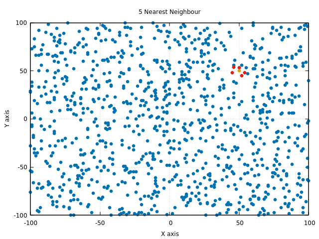
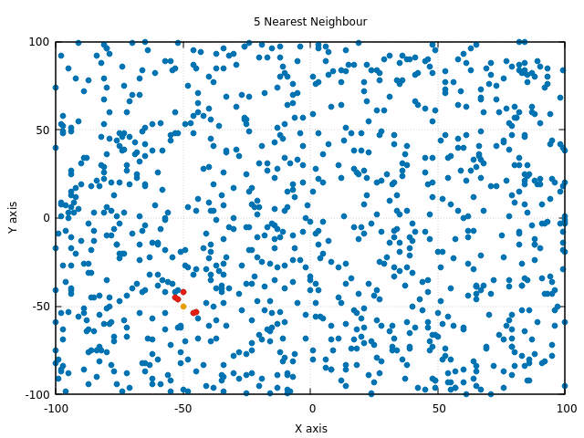
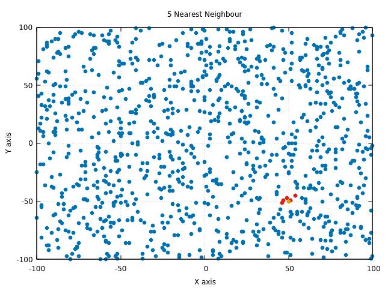

# k_nearest_neighbour

### Problem
Write an efficient C++ program to hold a set of 1000 points. The program receives an input point
from the user. Then, the program finds 5 points in the set that have minimum Euclidian distance
to the given point.

### Solution
- Create 1000 random points using the unifom random distribution generator for the given range(-100,100).
- Iterate through the 1000 points.
- For every point calculate the distance mertic between the given point and target point.
- Note: We do not take the square root of the answer as the actual distance is not needed for the given problem.
- Create a priority queue which will hold the K elements where the highest element is always on the top.
- Iterate through the list of points.
- Push the first 'k' points into the priority queue.
- After first 'k' points, push the point into the queue if the distance of the max element in the queue is higher than the distance that between the target and current point.

- The complexity of the algorithm is O(n-klog(n))

### Alternate not so efficient solutions
- Note: In the above algorithm we never sorted the list of points.
- Alternate 1: Calculate the distances between all the 1000 points and the target point. Quick sort them and pick the first K.
### Steps
```
sudo apt-get install gnuplot
g++ five_nearest_neighbour.cpp -o five_nearest_neighbour
./five_nearest_neighbour

Enter the Target point X(-100 to 100): 0
Enter the Target point Y(-100 to 100): 0
Enter the Value of K(1- 1000): 5
Nearest Point 2 -8
Nearest Point -1 -7
Nearest Point 2 6
Nearest Point 1 -6
Nearest Point 0 -1

gnuplot -persist gnu_plot_script
```

K=5,TargetPoint=(50,50)             |  K=5,TargetPoint=(-50,50)
:-------------------------:|:-------------------------:
  |  

K=5,TargetPoint=(-50,-50)             |  K=5,TargetPoint=(50,-50)
:-------------------------:|:-------------------------:
  |  

